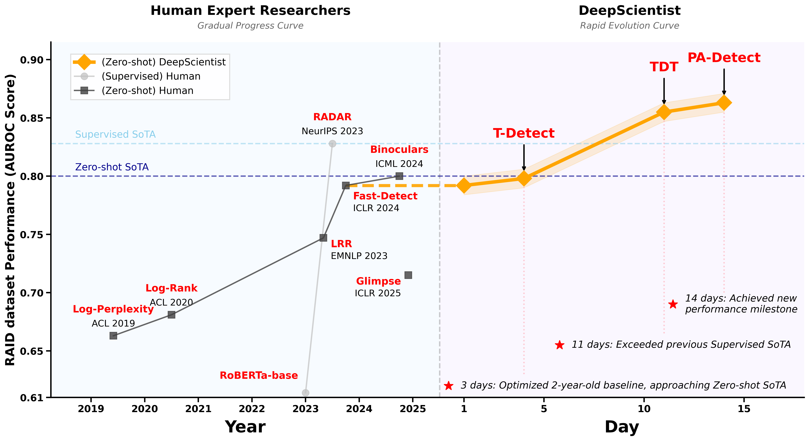

# DeepScientist: Advancing the Frontier of Scientific Discovery

We're excited to share DeepScientist, the first large-scale empirical evidence that an Artificial Intelligence (AI) can progressively surpass the human state-of-the-art (SOTA) on frontier scientific tasks.

We have now demonstrated that AI can genuinely push the frontier forward. The new question we face is how to enhance AI's scientific discovery capabilities while minimizing resource consumption. As the first automated, full-cycle scientific discovery system, DeepScientist can generate novel, SOTA-surpassing methods and continuously advance the scientific frontier at a pace far exceeding human researchers.

### Open Source Plan
Our entire open source plan will be divided into four phases.

#### Phase 0: General Agent Framework
We have already open-sourced the front-end and back-end code at [ResearAI/ResearStudio](https://github.com/ResearAI/ResearStudio). You can use it as a foundation to build various professional Agents with your own custom tools.

#### Phase 1: Application-Based Access (Expected before Oct 1st)
To ensure safety, we will invite a small group of users to try DeepScientist. If you have a task you're ready to explore, please fill out our [Waitlist Form](https://forms.gle/8FnGgqgBVEKv3q6a7). We will collaborate with you to further refine DeepScientist.

#### Phase 2: Foundational Components Release (Expected before Oct 15th)
After ensuring safety, we will open-source our foundational components. At this stage, you can immediately start building your own DeepScientist or replicating our work (perhaps an "Open-DeepScientist," which we strongly encourage!):

- Implementing DeepScientist doesn't require massive engineering efforts, especially with our foundational components. It took us only about one month starting from [ResearStudio](https://github.com/ResearAI/ResearStudio).

- Your implementation could very well be more elegant and efficient than ours. We admit that our implementation of components and workflows still contains some unpolished code and design.

- Don't limit your imagination. DeepScientist is just one small step. Automating scientific discovery with AI is an incredibly exciting field with vast room for exploration!

#### Phase 3: Experimental Data Release (Expected after November)
We will open-source all ~5,000 hypotheses and ~1,100 experimental logs. This will be the first time such a large-scale dataset of AI-generated experimental results has been made public.

#### Phase 4: DeepScientist Source Code Release
We will act responsibly, conducting long-term testing and adjustments to prevent any potential harm to human research. Following this, we will release the core architecture of the DeepScientist code to foster community development.

### A Few Thoughts

- Build a nanoDeepScientist! We encourage everyone to try creating simplified versions of an automated exploration agent. It's a great way to explore the core principles.

- The "memory" is simpler than it looks. The Findings Memory that powers our system can be built with a basic embedding model. Don't be intimidated!

- Discovery is about to get much faster. The core question is no longer "Can AI innovate?" but "How can we best guide its powerful exploratory process to maximize scientific return?" Let's figure it out together.
